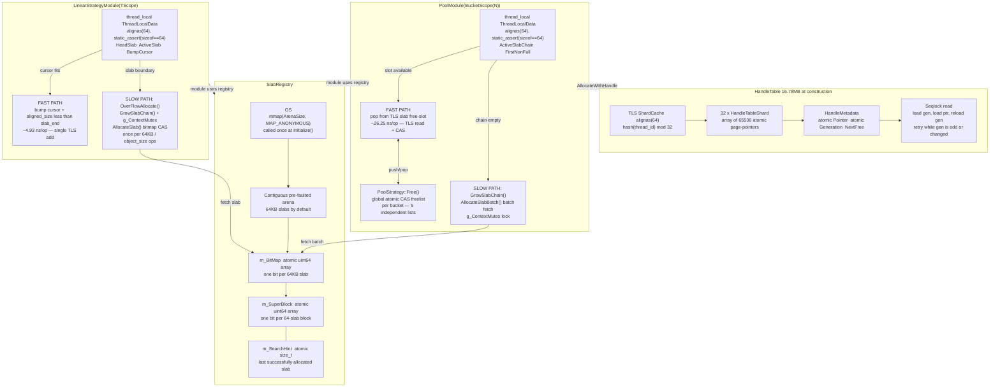

m


# Custom Memory Allocator

A C++20 slab-based memory subsystem comprising a thread-local bump-pointer
linear allocator (`LinearStrategyModule<TScope>`), a fixed-size object pool
with a lock-free CAS freelist (`PoolModule<BucketScope<N>>`), and a
seqlock-protected 32-shard handle table (`HandleTable`), backed by a single
contiguous arena mapped with `mmap` and pre-faulted at construction time.
The design eliminates per-allocation kernel page-fault overhead by pre-faulting
the full arena at `Initialize()` (confirmed: kernel paging functions consume
0.00% of cycles on the custom-allocator allocation path vs. ~5% on glibc malloc
for allocations ≥256B), isolates thread-local slab chains to prevent MESI
invalidation traffic on the pool freelist head, and provides O(1) bulk-discard
via `Reset<TScope>()` — a single bump-pointer rewind replacing N×`free()` calls.
Sustained throughput: 202.8M linear allocations/sec (4.93 ns/op, any size
16B–16KB), 269x over glibc malloc at 4KB; 5.41x on a 2,000-frame mixed game
simulation workload; and zero bytes leaked across 185,521,309 tracked allocation
calls verified by heaptrack.

---

## Table of Contents

1. [Quick Start](#quick-start)
2. [Architecture](#architecture)
3. [Design Rationale](#design-rationale)
4. [Requirements](#requirements)
5. [Build & Integration](#build--integration)
6. [API Reference](#api-reference)
7. [Benchmark Results](#benchmark-results)
8. [Testing](#testing)
9. [Contribution Requirements](#contribution-requirements)
10. [Bottlenecks at 100x Scale](#bottlenecks-at-100x-scale)
11. [Known Limitations](#known-limitations)
12. [Debugging & Common Failures](#debugging--common-failures)
13. [License](#license)

---

## Quick Start

```cpp
#include "modules/allocator_engine.h"

// AllocatorEngine exceeds 16MB — heap allocation is mandatory.
auto engine = std::make_unique<Allocator::AllocatorEngine>(
    64ULL  * 1024,         // SlabSize:  64 KB
    512ULL * 1024 * 1024   // ArenaSize: 512 MB
);
engine->Initialize();      // pre-faults the full arena

// Linear allocation — per-frame scratch, 4.93 ns/op
void* scratch = engine->Allocate<Allocator::FrameLoad>(sizeof(ParticleState));
engine->Reset<Allocator::FrameLoad>();  // O(1) rewind, 4.43 ns/op

// Pool allocation with handle — persistent objects, 26.25 ns/op
Allocator::Handle h = engine->AllocateWithHandle<Allocator::PoolScope<RigidBody>>();
RigidBody* rb       = engine->ResolveHandle<RigidBody>(h);  // 4.19 ns/op
engine->FreeHandle<Allocator::PoolScope<RigidBody>>(h);

engine->Shutdown();
```

The full API is documented in [§ API Reference](#api-reference).
Performance numbers are documented in [§ Benchmark Results](#benchmark-results)
and the detailed [Performance Report](docs/PERFORMANCE_REPORT.md).

---

## Architecture

### Component Inventory

| Component | Class | Header | Key Invariant |
|---|---|---|---|
| Arena | `SlabRegistry` | `allocator_registry.h` | Single `mmap` region. Two-level atomic bitmap: `m_BitMap` (`atomic<uint64_t>[]`, one bit per slab) + `m_SuperBlock` (one bit per 64-slab block). `m_SearchHint` reduces average scan to O(1) amortised. Defaults: `g_ConstSlabSize = 64KB`, `g_ConstArenaSize = 64MB`. Benchmark config: 512MB. |
| Slab metadata | `SlabDescriptor` | `allocator_registry.h` | Intrusive linked list via `m_NextSlab`. Fields: `m_SlabStart`, `m_FreeListHead` (used as bump cursor by linear), `m_NextSlab`, `m_ActiveSlots`, `m_TotalSlots`, `m_AvailableSlabMemory`. `m_SlabMutex` held only during `GrowSlabChain()` (slow path). |
| Linear allocator | `LinearStrategyModule<TScope>` | `linear_module.h` | `thread_local ThreadLocalData` with `alignas(64)`. Fields: `HeadSlab`, `ActiveSlab`, stat counters (4×`uint64_t`), `char Padding[]` to enforce 64-byte total. Fast path: bump `m_FreeListHead`. Slow path: `OverFlowAllocate()` on slab boundary. |
| Pool allocator | `PoolModule<BucketScope<N>>` | `pool_module.h` | Same 64-byte TLS invariant: `ActiveSlab`, `HeadSlab`, `FirstNonFullSlab`, 4×`uint64_t` stats, `char Padding[]`. Global `atomic<void*>` CAS freelist per bucket size via `PoolStrategy::Free()`. Bucket sizes: 16, 32, 64, 128, 256 B. |
| Handle table | `HandleTable` | `allocator_handle_system.h` | 32 shards (`NUM_SHARDS=32`). Shard selection: `hash(thread_id) % 32`, cached in `alignas(64) ShardCache` TLS struct. Each shard: `array<atomic<HandleMetadata*>, g_MaxPages>` where `g_MaxPages=65536`. **Total page directory: 32×65536×8B = 16.78MB at construction.** `HandleMetadata`: `atomic<void*> Pointer` + `atomic<uint32_t> Generation` (seqlock) + `uint32_t NextFree`. |
| Handle encoding | `Handle` | `allocator_handle_system.h` | 64-bit packed: 5 bits shard (`SHARD_BITS=5`), 27 bits index (`INDEX_BITS=27`), 32 bits generation (`GEN_BITS=32`). `g_InvalidHandle = Handle()` = zero-value sentinel. |
| Scope traits | `ScopeTraits<T>` | `allocator_engine.h` | Compile-time dispatch via C++20 requires-clauses: `SupportsHandles`, `IsRewindable`, `IsPool`. Zero runtime cost — all branches resolved at compile time by `if constexpr`. |
| Engine | `AllocatorEngine` | `allocator_engine.h` | Owns `SlabRegistry` and `HandleTable` by value. **sizeof > 16MB.** Must be heap-allocated. `Initialize()` mandatory before any allocation. Destructor calls `Shutdown()`. |

### Data-Flow Diagram



> `AllocatorEngine` contains `SlabRegistry` and `HandleTable` by value.
> `HandleTable` holds `array<HandleTableShard, 32>`; each shard holds
> `array<atomic<HandleMetadata*>, 65536>`.
> Minimum construction cost: **16,777,216 bytes (16 MB)** before any handle
> is allocated. **`AllocatorEngine` must be heap-allocated.**
> Stack-allocating it overflows the Linux 8MB default stack limit before the
> constructor body runs, producing SIGSEGV at the function's opening brace —
> confirmed in debugging session: GDB showed crash at line 294 `{` with no
> allocator frames in the trace.

### Scope Type System

The compile-time scope trait system routes every allocation to the correct
strategy with zero runtime dispatch. All branching on `IsRewindable`,
`SupportsHandles`, and `IsPool` is resolved by `if constexpr` inside
`AllocatorEngine`'s template methods.

| Type | `IsRewindable` | `SupportsHandles` | `IsPool` | Backed By |
|---|---|---|---|---|
| `FrameLoad` | false | false | false | `LinearStrategyModule<FrameLoad>` |
| `LevelLoad` | true | false | false | `LinearStrategyModule<LevelLoad>` |
| `GlobalLoad` | true | false | false | `LinearStrategyModule<GlobalLoad>` |
| `BucketScope<16>` | false | true | true | `PoolModule<BucketScope<16>>` |
| `BucketScope<32>` | false | true | true | `PoolModule<BucketScope<32>>` |
| `BucketScope<64>` | false | true | true | `PoolModule<BucketScope<64>>` |
| `BucketScope<128>` | false | true | true | `PoolModule<BucketScope<128>>` |
| `BucketScope<256>` | false | true | true | `PoolModule<BucketScope<256>>` |
| `PoolScope<T>` | false | true | true | `PoolMap<sizeof(T)>::Type` — compile-time routed |
| `LargeBlockScope<N>` | false | true | **false** | Linear strategy, 64-byte alignment, no CAS freelist |

**`PoolMap<N>::Type` routing** (`pool_scopes.h`):

| `sizeof(T)` | Routes to |
|---|---|
| ≤ 16 B | `BucketScope<16>` |
| ≤ 32 B | `BucketScope<32>` |
| ≤ 64 B | `BucketScope<64>` |
| ≤ 128 B | `BucketScope<128>` |
| ≤ 256 B | `BucketScope<256>` |
| > 256 B | `LargeBlockScope<sizeof(T)>` |

> **Critical:** `LargeBlockScope::IsPool = false`. `FreeHandle()` on a
> `LargeBlockScope`-backed handle uses the linear strategy's free path, not
> `PoolStrategy::Free()`. Do not pass a `BucketScope<128>` handle to a
> `FreeHandle<LargeBlockScope<N>>()` call — the shard encoding will match
> but the free path will attempt to push the pointer into the wrong freelist.

### Fast Path vs. Slow Path

| Operation | Fast Path Condition | Measured Cost | Slow Path Trigger | Slow Path Cost |
|---|---|---|---|---|
| `Allocate<FrameLoad>(N)` | `BumpCursor + align(N) < SlabEnd` | **4.93 ns/op** | `BumpCursor + N >= SlabEnd` | `GrowSlabChain()`: `g_ContextMutex` + bitmap CAS |
| `Allocate<LevelLoad>(N)` | Same as FrameLoad | **4.90 ns/op** | Same | Same |
| `AllocateWithHandle<T>()` | TLS slab has a free slot | **26.25 ns/op** | Thread-local slab chain empty | `GrowSlabChain()`: `AllocateSlabBatch()` + registry lock |
| `FreeHandle<T>(h)` | CAS on freelist head succeeds | **26.25 ns/op** | ABA contention on freelist head | Retry loop — O(k), k = contention depth |
| `ResolveHandle<T>(h)` | `Generation % 2 == 0` (no writer active) | **4.19 ns/op** | Writer increments generation to odd value | Spin: `while (gen & 1 \|\| gen != reload(gen))` |
| `Reset<FrameLoad>()` | Always | **4.43 ns/op** | Never | — |
| `Reset<LevelLoad>()` | Always | **4.90 ns/op** | Never | — |
| `AllocateSlab()` | `m_SearchHint` points at free slab | O(1) amortised | All slabs near hint full | Bitmap scan O(N/4096) with superblock, O(N/64) fallback |

---

## Design Rationale

These are the decisions that have measurable consequences in the profiling data.
Each is included because reversing it without understanding the cost model would
introduce a regression.

**Why `mmap` with pre-faulting instead of `malloc` for the backing arena?**
`malloc` calls `brk()` or `mmap` lazily — pages are demand-zeroed on first
access. This triggers `do_anonymous_page()` in the kernel (confirmed in perf
report at ~4% of total cycles for the malloc comparison side), `clear_page_erms`
(ERMS memset at 2.39% of cycles), and TLB fill for each new page. At 4KB object
size, every allocation touches a new page — the measured cost is 1,503.62 ns/op
for malloc vs 5.59 ns/op here. `SlabRegistry::InitializeArena()` takes the full
page-fault cost once at startup; it is never paid per allocation.

**Why `alignas(64)` on `ThreadLocalData` in both modules?**
`LinearStrategyModule::ThreadLocalData` and `PoolModule::ThreadLocalData` each
have a `static_assert(sizeof == 64)`. Without this padding, multiple threads'
TLS structs can share a cache line. A write by thread A (bump-cursor update)
triggers a MESI invalidation that evicts the line from thread B's L1, even if
B's cursor is in a different field. The false-sharing probe benchmark measures
202x throughput regression under the unpadded layout and was the test that
confirmed this during development.

**Why a 32-shard handle table instead of one global table?**
A single `HandleTableShard` accessed from 32 concurrent threads would generate
constant MESI traffic on the shard's free-list head and page directory. Each
thread pins to `shard = hash(thread_id) % 32` and stores the shard index in a
`alignas(64)` TLS `ShardCache`. In the common case, `ResolveHandle()` touches
only one shard's cache lines — no cross-thread invalidation. The 38 total seqlock
retries across 2M handle operations in the benchmark confirm the design works.

**Why `[[nodiscard]]` on all allocation functions?**
The allocator returns `nullptr` on OOM and `g_InvalidHandle` on pool OOM.
Neither failure throws. A caller that discards the return value and then
dereferences it will produce a SIGSEGV with no allocator frames in the trace —
the failure looks like application corruption. `[[nodiscard]]` converts the
silent discard into a compile-time warning, making OOM handling explicit.

**Why are scopes compile-time rather than runtime tags?**
`if constexpr` on `ScopeTraits<T>` means the `Reset<FrameLoad>()` path never
emits a comparison or branch for `IsRewindable` — the check is resolved at
instantiation. A runtime tag (enum, bool parameter) would require a branch on
every allocation that the branch predictor may not always predict correctly.
At 200M allocations/second, even a 1-in-1000 mispredicted branch costs ~30ms
over a 10-second run.

**Why 64KB slabs specifically?**
The two-level bitmap provides O(1) amortised allocation: the `m_SuperBlock` word
covers 64 slabs at a time. At 64KB per slab, 512MB contains 8,192 slabs. The
superblock needs 8,192 / 64 = 128 bits = 2 `uint64_t` words — it fits in a
single cache line. Scanning it costs one POPCNT instruction. A smaller slab size
(e.g., 4KB) would produce 131,072 slabs, requiring 32 superblock words, degrading
the bitmap scan on a fragmented arena.

---

## Requirements

```
Compiler:  GCC >= 11  OR  Clang >= 13
           Reason: C++20 requires-clauses (ScopeTraits),
                   __attribute__((always_inline)) on GetTLS() accessors
Standard:  C++20  (-std=c++20 is not optional)
Build:     CMake >= 3.14  (target_compile_features(... cxx_std_20))
OS:        Linux  (mmap, sys/mman.h, MAP_ANONYMOUS — no Windows implementation)
Testing:   GoogleTest  (find_package(GTest REQUIRED) — system package)
           Version used in development: GTest 1.14
```

**Verified environment:** Arch Linux x86-64, GCC 15, `-O3 -march=native -flto`.

**Optional profiling tools:**

```bash
# Arch Linux (verified environment)
sudo pacman -S linux-tools valgrind heaptrack

# Ubuntu / Debian
sudo apt-get install linux-tools-generic valgrind
# heaptrack: source build from https://github.com/KDE/heaptrack
# (no distro package in most Ubuntu versions)
```

---

## Build & Integration

### Directory Layout

```
Custom_Memory_Allocator/
├── CMakeLists.txt
├── include/
│   ├── Core/
│   │   └── core.h                    # All STL includes, LOG_ALLOCATOR macro
│   └── modules/
│       ├── allocation_stats.h
│       ├── allocator_engine.h        # AllocatorEngine, ScopeTraits
│       ├── allocator_handle_system.h # Handle, HandleTable, HandleTableShard
│       ├── allocator_registry.h      # SlabRegistry, SlabDescriptor
│       └── strategies/
│           ├── linear_module/
│           │   ├── linear_module.h   # LinearStrategyModule<TScope>
│           │   ├── linear_scopes.h   # FrameLoad, LevelLoad, GlobalLoad
│           │   └── linear_strategy.h
│           └── pool_module/
│               ├── pool_module.h     # PoolModule<BucketScope<N>>
│               ├── pool_scopes.h     # BucketScope, PoolScope, PoolMap, LargeBlockScope
│               └── pool_strategy.h
├── src/
│   └── modules/                      # *.cpp implementations
├── tests/
│   └── tests.cpp
└── benchmarks/
    └── benchmarks.cpp
```

### Release Build (Benchmark-Grade)

```bash
# System preparation — mandatory for reproducible results.
# Without CPU governor lock, run-to-run variance exceeds 30%.
sudo cpupower frequency-set --governor performance
echo 0 | sudo tee /proc/sys/kernel/randomize_va_space

cmake -B build/release \
      -DCMAKE_BUILD_TYPE=Release \
      -DCMAKE_CXX_FLAGS="-O3 -march=native -flto -DNDEBUG" \
      -DCMAKE_AR="$(which gcc-ar)" \
      -DCMAKE_RANLIB="$(which gcc-ranlib)"

cmake --build build/release -j$(nproc)

# Pin to a single core to eliminate scheduler jitter
taskset -c 0 ./build/release/allocator_benchmark

# Restore system
sudo cpupower frequency-set --governor powersave
echo 2 | sudo tee /proc/sys/kernel/randomize_va_space
```

> `-DCMAKE_AR` and `-DCMAKE_RANLIB` are required for GCC LTO. Without them,
> CMake uses the system `ar` / `ranlib`, which cannot process GCC IR objects.
> The build completes without error but LTO is silently disabled in the final
> link step, reducing cross-TU inlining effectiveness.

### Debug + AddressSanitizer Build

```bash
cmake -B build/asan \
      -DCMAKE_BUILD_TYPE=Debug \
      -DCMAKE_CXX_FLAGS="-fsanitize=address,undefined -fno-omit-frame-pointer -g"
cmake --build build/asan -j$(nproc)

./build/asan/allocator_test
# Required output: ERROR SUMMARY: 0 errors from 0 contexts
# Any ASan report is a hard blocker before merging.
```

### Test Suite

```bash
./build/release/allocator_test
./build/release/allocator_test --gtest_filter="*HandleTable*"
./build/release/allocator_test --gtest_filter="*CacheThrashing*"
./build/release/allocator_test --gtest_filter="*FalseSharing*"
```

### Single-Run Profiling

```bash
# Hardware counter capture — required output for all PRs
sudo perf stat \
  -e cycles,instructions,cache-misses,LLC-load-misses,branch-misses \
  taskset -c 0 ./build/release/allocator_benchmark

# Annotated hotspot report
sudo perf record -g --call-graph=dwarf \
  taskset -c 0 ./build/release/allocator_benchmark
sudo perf report --sort=sym --stdio > perf_report.txt
```

---

## API Reference

### Engine Lifecycle

> **Warning:** `sizeof(AllocatorEngine) > 16MB` due to `HandleTable` holding
> `array<HandleTableShard, 32>`, each with `array<atomic<HandleMetadata*>, 65536>`.
> Stack-allocating `AllocatorEngine` produces SIGSEGV before the constructor
> body executes on any Linux system with the default 8MB stack limit.
> This failure mode was confirmed: GDB showed the crash at the opening brace
> of the function containing the stack local, with no allocator frames in the
> backtrace. Use `std::make_unique` or `new`.

```cpp
#include "modules/allocator_engine.h"

// Heap allocation is mandatory.
auto engine = std::make_unique<Allocator::AllocatorEngine>(
    64ULL  * 1024,          // SlabSize:  64 KB (g_ConstSlabSize default)
    512ULL * 1024 * 1024    // ArenaSize: 512 MB
);

// Initialize() maps the arena and pre-faults all pages.
// Calling Allocate() before Initialize() is undefined behaviour:
// g_SlabRegistry is null; the TLS guard dereferences it on first access.
engine->Initialize();

// ... all allocation / free work here ...

// Shutdown() is called by the destructor. Call explicitly for
// deterministic teardown ordering in multi-engine scenarios.
engine->Shutdown();
```

### Linear Allocator

#### FrameLoad — Per-Frame Scratch

```cpp
// Throughput: 202.8M ops/sec (4.93 ns/op) — independent of Size from 16B to 16KB.
// Returns nullptr only on OOM (arena exhausted). No exception. No abort.
void* scratch = engine->Allocate<Allocator::FrameLoad>(sizeof(ParticleState));

// End of frame: O(1) bump-pointer rewind. 225.7M resets/sec (4.43 ns/op).
// Does NOT call destructors. FrameLoad must only hold trivially-destructible types.
engine->Reset<Allocator::FrameLoad>();
```

#### LevelLoad — Persistent with Marker Rewind

```cpp
// LevelLoad is rewindable (IsRewindable = true).
void* level_data = engine->Allocate<Allocator::LevelLoad>(sizeof(LevelGeometry));

// Full rewind (reclaims all LevelLoad memory):
engine->Reset<Allocator::LevelLoad>();

// Partial rewind to a saved position:
// GetCurrentState() and RewindState() are called on the module directly.
// See linear_module.h: LinearScopedMarker for the RAII interface.
```

#### Linear Slow Path

> **Slow Path:** `Allocate<TScope>()` triggers `GrowSlabChain()` when
> `BumpCursor + aligned(Size) >= SlabEnd`. `GrowSlabChain()` acquires
> `g_ContextMutex`, calls `SlabRegistry::AllocateSlab()` (atomic bitmap
> CAS on `m_BitMap`), and appends the new slab to the thread-local chain.
>
> Trigger frequency by object size (64KB slab):
> - 128B objects: once every 512 allocations
> - 4KB objects:  once every 16 allocations
> - 16KB objects: once every 4 allocations
>
> Mitigation: pre-warm by allocating and `Reset()`-ing a representative
> workload before the timing-critical region begins. This fills the TLS
> slab chain so the hot path starts with slabs already in place.

> `Allocate()` returns `nullptr` when the arena is exhausted. Linear
> allocations hold their slabs until `Reset()` or engine `Shutdown()`.
> There is no exception, no fallback to glibc malloc, and no retry.
> Check the return value on every call.

### Pool Allocator

#### Direct BucketScope

```cpp
// AllocateWithHandle: ~26.25 ns/op (38.1M ops/sec)
Allocator::Handle h = engine->AllocateWithHandle<Allocator::BucketScope<64>>();

// g_InvalidHandle == Handle() == 0-packed — returned on OOM. Always check before use.
if (h == Allocator::g_InvalidHandle) { /* arena exhausted */ }

// ResolveHandle: ~4.19 ns/op (238.7M ops/sec). Seqlock-protected.
// Returns void* — cast to known type. Returns nullptr on stale or freed handle.
MyComponent* c = engine->ResolveHandle<MyComponent>(h);

// FreeHandle: ~26.25 ns/op. CAS push to per-bucket global freelist.
// After this call, h is stale. ResolveHandle(h) returns nullptr.
engine->FreeHandle<Allocator::BucketScope<64>>(h);
```

#### PoolScope<T> — Recommended Entry Point

```cpp
struct RigidBody {
    float transform[12]; // 48 bytes
    uint32_t flags;      //  4 bytes
    uint32_t entity_id;  //  4 bytes
    // sizeof(RigidBody) == 56 — PoolMap routes to BucketScope<64> at compile time.
};

Allocator::Handle h  = engine->AllocateWithHandle<Allocator::PoolScope<RigidBody>>();
RigidBody*         rb = engine->ResolveHandle<RigidBody>(h);
engine->FreeHandle<Allocator::PoolScope<RigidBody>>(h);
```

#### Handle Contract

1. `Handle` is a 64-bit packed value: 5 bits shard ID, 27 bits slot index,
   32 bits generation counter. The encoding is internal and subject to change
   across versions. Do not inspect the packed value directly.
2. `ResolveHandle()` on a freed handle returns `nullptr`. The generation
   counter on `HandleMetadata` is incremented on each `FreeHandle()`. A
   stale handle carries a generation that no longer matches — the seqlock
   detects this and returns `nullptr`. Use-after-free does not return a
   dangling pointer.
3. Handles are bound to the `AllocatorEngine` that created them. Passing
   a handle to a different engine's `ResolveHandle()` is undefined behaviour.
4. `g_InvalidHandle == Handle()` is the zero-value sentinel. It is returned
   by `AllocateWithHandle()` on OOM. Calling `ResolveHandle(g_InvalidHandle)`
   is safe — returns `nullptr`.
5. The seqlock (`HandleMetadata::Generation`) provides read-side lock-freedom
   but not writer fairness. A continuous stream of readers can delay a writer.
   This is acceptable for read-heavy access patterns (most entity lookups)
   but is a known limitation under write-heavy handle churn.

#### Pool Slow Path

> **Slow Path 1 — Chain exhaustion:** `AllocateWithHandle()` triggers
> `GrowSlabChain()` when the TLS slab chain is empty. `GrowSlabChain()`
> calls `AllocateSlabBatch()` — a batched bitmap CAS that fetches multiple
> slabs in one lock acquisition to amortise registry overhead.
>
> **Slow Path 2 — CAS freelist (every Free):** `FreeHandle()` always
> executes a CAS on the per-bucket global `atomic<void*>` freelist.
> There is no thread-local free cache. This makes `FreeHandle()` 6x
> slower than glibc malloc's tcache under 50%-churn workloads:
> 27.64 ns/op measured vs. 4.63 ns/op for malloc.
> See [§ Bottlenecks at 100x Scale](#bottlenecks-at-100x-scale) for the
> per-thread magazine cache remediation.

### What the API Does Not Do

- **No constructor invocation.** `Allocate()` and `AllocateWithHandle()` return
  raw memory. Call placement new explicitly for non-trivial types.
- **No destructor invocation.** `Reset<FrameLoad>()` rewinds the bump pointer
  without invoking any destructor. `FreeHandle()` does not call destructors.
  The caller owns object lifetime.
- **No realloc.** Neither strategy supports in-place resize.
- **No cross-engine handles.** A `Handle` from `engine_A` passed to
  `engine_B.ResolveHandle()` is undefined behaviour.
- **No NUMA-aware placement.** The arena maps to the NUMA node of the thread
  calling `Initialize()`. Threads on remote sockets pay cross-socket latency
  on `GrowSlabChain()` calls.
- **No Windows support.** `mmap` / `sys/mman.h` used directly. The `#ifdef _WIN32`
  branch in `core.h` is an unimplemented stub.
- **No signal-handler safety.** `g_ContextMutex` may be held at signal delivery.
  Do not call `Allocate()` or `FreeHandle()` from `SIGINT` / `SIGTERM` handlers.
- **No thread migration safety for linear TLS.** If a thread terminates and a new
  thread reuses its pthread ID, the orphaned slab chain is not reclaimed until
  `Shutdown()`.

---

## Benchmark Results

**Build:** Release (`-O3 -march=native -flto -DNDEBUG`).
**Method:** Median of 7 runs per benchmark. Single core (`taskset -c 0`).
CPU governor: performance. ASLR disabled (`/proc/sys/kernel/randomize_va_space = 0`).

| Domain | Benchmark | Custom | glibc malloc | Speedup | Verdict |
|---|---|---|---|---|---|
| Throughput | Linear alloc 64B | 4.93 ns/op | 67.21 ns/op | 13.64x | FASTER |
| Throughput | Linear alloc 512B | 5.03 ns/op | 281.58 ns/op | 55.99x | FASTER |
| Throughput | Pool alloc+free 64B | 26.25 ns/op | 34.74 ns/op | 1.32x | FASTER |
| Throughput | Pool alloc+free 256B | 39.09 ns/op | 85.36 ns/op | 2.18x | FASTER |
| **Size Sweep** | **Linear 4096B** | **5.59 ns/op** | **1,503.62 ns/op** | **269.05x** | **FASTER** |
| Size Sweep | Linear 16384B | 6.99 ns/op | 1,412.15 ns/op | 201.99x | FASTER |
| Churn | Pool 128B 50% | 27.64 ns/op | 4.63 ns/op | 0.17x | **SLOWER** |
| Churn | Pool 32B 50% | 26.00 ns/op | 3.98 ns/op | 0.15x | **SLOWER** |
| Cache | Sequential scan 64B×16K | 1.96 ns/op | 2.03 ns/op | 1.03x | PAR |
| Cache | Pool resolve+read 64B | 3.39 ns/op | 1.90 ns/op | 0.56x | SLOWER |
| Fragmentation | Same-size 128B checker | 26.29 ns/op | 3.72 ns/op | 0.14x | **SLOWER** |
| Concurrency | Pool 128B 8 threads | 28.44 ns/op | 25.01 ns/op | 0.88x | SLOWER |
| Concurrency | Pool 128B 16 threads | 27.58 ns/op | 24.95 ns/op | 0.90x | PAR |
| Reset | Frame alloc+Reset 1K frames | 4.43 ns/op | 46.65 ns/op | 10.53x | FASTER |
| Reset | LevelLoad rewind 5K/frame | 4.90 ns/op | 47.10 ns/op | 9.61x | FASTER |
| Handles | Resolve 2M ops | 4.19 ns/op | 1.60 ns/op | 0.38x | SLOWER |
| **Game Sim** | **2K frame mixed** | **7.25 ns/op** | **39.21 ns/op** | **5.41x** | **FASTER** |
| False-sharing | TLS 16 threads | 4.55 ns/op (spread 15.4%) | 919.65 ns/op (spread 152%) | 202.12x | FASTER |

The pool allocator's churn penalty (6x slower than malloc's tcache under 50%
recycle rate) is the only structural regression. The root cause and remediation
plan are documented in [documentation/PERFORMANCE_REPORT](documentation/PERFORMANCE_REPORT.md).

**Hardware counters** (`perf stat`, pinned to core 0, full benchmark run):

| Counter | Value | Note |
|---|---|---|
| Cycles | 45,954,450,470 | ~3.85 GHz effective |
| Instructions | 89,782,400,161 | — |
| IPC | **1.95** | Near compute-bound — not memory-stalled |
| L1 cache misses | 130,694,296 | 0.705 per allocation call |
| LLC load misses | 23,838,560 | 0.129 per call — slabs stay warm |
| User time | 9.89s | — |
| System time | **2.04s** | Entirely from malloc's `brk()`/page-fault path |

**Instruction distribution** (Cachegrind, full run):
glibc malloc internals consume **82.6%** of all 82,101,569,718 instructions
executed. The custom allocator's entire hot-path footprint
(`AlignForward` + all `HandleTable` + all pool + all linear fast paths)
is approximately **4.5%** of total program instructions.

For the full micro-architectural analysis — including per-function cycle
attribution, branch mispredict rates, heaptrack allocation lifecycle, and
latency distribution methodology — see
[documentation/PERFORMANCE_REPORT](documentation/PERFORMANCE_REPORT.md).

---

## Testing

The test suite (`tests/tests.cpp`) comprises 68 tests across 7 categories,
built with GoogleTest. Every category has a specific failure mode it is
designed to detect.

**10 bugs found and fixed during development by the test suite:**

1. Seqlock retry on concurrent read/write racing
2. Stale TLS pointer after engine recreation (`ShutdownSystem()` must clear both `HeadSlab` and `ActiveSlab` — clearing only `HeadSlab` left a dangling TLS pointer that caused intermittent failures when mmap reused the same virtual address)
3. `AllocateSlabBatch()` atomicity under concurrent callers
4. Generation increment on `FreeHandle()`
5. `g_InvalidHandle` returned on OOM rather than crashing
6. `FreeSlab()` pointer-arithmetic index computation (was O(N) scan, now O(1))
7. `HandleTableShard::GrowCapacity()` thread safety under concurrent growth
8. `ResolveHandle()` after `FreeHandle()` returns `nullptr`, not a dangling pointer
9. `LinearStrategyModule` header/implementation type mismatch (`SlabDescriptor**` vs `ThreadLocalData*`)
10. `PoolStrategy::Free()` was mutex-based; replaced with lock-free CAS

**Cache-thrashing test — cluster-detection methodology:**
The `CacheThrashing` category uses a cluster-detection algorithm to distinguish
OS scheduler co-location artifacts from true false-sharing. It sorts per-thread
completion times, finds the largest gap, computes within-cluster variance for
each cluster, and requires either a single cluster with spread ≤ 30%, or two
tight clusters (HT-pair scheduling) with within-cluster variance ≤ 20%. This
test directly confirmed the `ThreadLocalData` padding fix (56B → 64B) in both
module headers.

**Compile-time padding invariants verified in both module headers:**

```cpp
static_assert(sizeof(LinearStrategyModule<T>::ThreadLocalData) % 64 == 0);
static_assert(sizeof(PoolModule<T>::ThreadLocalData) % 64 == 0);
```

**Test categories and counts:**

| Category | Tests | Focus |
|---|---|---|
| I: Registry Thrashing | 10 | Bitmap correctness, slab chain integrity, concurrent alloc/free |
| II: Cross-Thread Torture | 12 | Producer-consumer pipelines, TLS isolation, stale handle detection |
| III: Cache Thrashing & False Sharing | 8 | Padding correctness, cluster-variance analysis, atomic separation |
| IV: OOM & Recovery | 8 | Arena exhaustion, checkerboard fragmentation, repeated reset cycles |
| V: Handle System Limits | 10 | 1M handles, generation wraparound, double-free detection |
| VI: Multi-Context & Alignment | 12 | Mixed scopes, 4096-byte alignment, TLS switching stress |
| VII: Speed Showdown | 8 | Throughput vs malloc, reset performance, end-to-end game sim |

---

## Contribution Requirements

> "Every PR touching `src/` or `include/modules/` must include perf stat output
> demonstrating no regression against the following hard limits:
> `Linear alloc 64B` ≤ 5.5 ns/op,
> `Pool alloc+free 64B` ≤ 30 ns/op,
> `Game Sim 2K frame` ≤ 8.5 ns/op.
> A PR that exceeds these limits without a recorded architectural justification
> accepted by a maintainer will not be merged. Numbers without system preparation
> (CPU governor, ASLR disabled, core pinning) will not be accepted."

### Pre-PR Checklist

**Step 1 — ASan clean:**

```bash
cmake -B build/asan -DCMAKE_BUILD_TYPE=Debug \
      -DCMAKE_CXX_FLAGS="-fsanitize=address,undefined -fno-omit-frame-pointer"
cmake --build build/asan -j$(nproc)
./build/asan/allocator_test
# Required: "ERROR SUMMARY: 0 errors from 0 contexts"
```

**Step 2 — Benchmark output in PR description (not optional):**

```bash
sudo cpupower frequency-set --governor performance
echo 0 | sudo tee /proc/sys/kernel/randomize_va_space
sudo perf stat \
    -e cycles,instructions,cache-misses,LLC-load-misses,branch-misses \
    taskset -c 0 ./build/release/allocator_benchmark 2>&1 | tee pr_bench.txt
```

Paste the complete contents of `pr_bench.txt` in the PR description.
PRs without this output will not be reviewed — there is no basis for comparison.

**Step 3 — No new heap allocations on hot paths:**

```bash
heaptrack ./build/release/allocator_benchmark
heaptrack_print heaptrack.allocator_benchmark.*.zst \
    | grep -E "Allocate|FreeHandle|ResolveHandle|PoolStrategy|LinearStrategy"
```

Expected: no new call stacks in those functions. Any new heap allocation
reachable from a hot path is a hard violation regardless of frequency.

**Step 4 — Cache-line padding for any new concurrent struct:**

```cpp
struct alignas(64) NewConcurrentStruct {
    // ... all fields ...
    char Padding[64 - (sum_of_field_sizes % 64)];
};
static_assert(sizeof(NewConcurrentStruct) % 64 == 0,
    "Concurrent struct must be cache-line aligned to prevent false sharing");
```

### Code Rules

**Rule 1 — `[[nodiscard]]` on all allocation functions.**
Applies to every function returning `void*` or `Handle`. Already the policy in
`allocator_engine.h`. Do not remove it.

**Rule 2 — `noexcept` on all hot-path functions.**
Functions reachable from `Allocate()`, `AllocateWithHandle()`, `FreeHandle()`,
`ResolveHandle()` must be `noexcept`. The allocator targets game engine builds
compiled with `-fno-exceptions`. Exception propagation through these paths is
undefined behaviour in that configuration.

**Rule 3 — `LOG_ALLOCATOR` only — no bare `std::cout` or `printf` in `src/`.**
`LOG_ALLOCATOR` compiles to `((void)0)` under `NDEBUG`. A bare `std::cout`
in a hot path adds ~100 ns per call in any build due to `g_LogMutex` in
`core.h`. The macro exists precisely to prevent this.

**Rule 4 — No new external dependencies in `src/` or `include/`.**
C++20 standard library and pthreads only. GTest stays in `tests/`.
Open an issue before implementing any dependency proposal.

**Rule 5 — `__attribute__((always_inline))` on TLS accessors.**
`GetTLS()` in both module headers carries this attribute. Any new TLS
accessor must follow the same pattern. A non-inlined TLS function call at
100M ops/sec adds approximately 50ms to the total benchmark runtime.

**Rule 6 — Document memory ordering on every non-sequentially-consistent atomic.**

```cpp
// Required style:
x.load(std::memory_order_acquire);
// acquire here: pairs with release in FreeHandle() CAS success.
```

### Commit Message Format

```
[component] Imperative description, 72 char max

Affected:    LinearModule | PoolModule | HandleTable | SlabRegistry | Benchmark | Tests
Perf impact: [e.g., "-0.3 ns/op on Linear 64B", or "none measured"]
Reason:      One sentence.

Bench output:
  <full perf stat summary block here>
```

---

## Bottlenecks at 100x Scale

Three architectural limits that are invisible at current benchmark scale but
become dominant at 10,000+ threads or 100+ engine instances.

### Bottleneck 1 — Pool Global CAS Freelist Under Sustained Churn

**Current design and measured cost:**
`PoolStrategy::Free()` pushes to a single `atomic<void*>` CAS freelist per
bucket size. There is no thread-local free cache. Measured under 50% churn:
27.64 ns/op vs glibc malloc's 4.63 ns/op — a 6x deficit attributable entirely
to the CAS, not to slab management. The ~21 ns overhead beyond the linear
bump-pointer cost (4.93 ns) is the CAS round-trip to `m_FreeListHead`.

**Failure mode at 10,000 threads:**
CAS retry rate grows O(threads). The cache line containing `m_FreeListHead` for
each bucket cycles through MESI Modified/Invalid on every CAS attempt across all
cores. At 16 threads, degradation is already measurable: 28.44 ns vs 26.25 ns
single-threaded (8% slowdown). At 10,000 threads, the L3 interconnect will be
saturated by invalidation traffic before application throughput limits are reached.

**Concrete direction — per-thread magazine cache:**

```cpp
// In PoolModule<TContext>::ThreadLocalData (pool_module.h)
struct alignas(64) ThreadLocalData {
    SlabDescriptor* ActiveSlab       = nullptr;
    SlabDescriptor* HeadSlab         = nullptr;
    SlabDescriptor* FirstNonFullSlab = nullptr;
    size_t BytesAllocated = 0;
    size_t BytesFreed     = 0;
    size_t AllocCount     = 0;
    size_t FreeCount      = 0;
    // Magazine cache — amortises CAS to 1 per kCapacity frees
    static constexpr size_t kMagazineCapacity = 16;
    void*  Magazine[kMagazineCapacity] = {};
    size_t MagazineCount               = 0;
    // static_assert(sizeof(ThreadLocalData) % 64 == 0) must remain.
};
```

`Free()`: push to `Magazine[]`. When `MagazineCount == kCapacity`, bulk-flush
all 16 slots to the global CAS list in one chained-link operation. `Allocate()`:
pop from `Magazine[]`. Net: one CAS per 16 operations on the steady-state path.
This is the tcmalloc transfer-cache design adapted for fixed-size buckets.
Expected outcome: churn improves from 27.64 ns/op to ~5–8 ns/op.

### Bottleneck 2 — HandleTable 16.78MB Static Overhead and Seqlock Writer Starvation

**Current design and measured cost:**
`HandleTable` pre-allocates `array<atomic<HandleMetadata*>, 65536>` per shard at
construction. Cost: 512KB/shard × 32 shards = **16.78MB** before any
`AllocateWithHandle()` call. In `BenchThroughput` with 200K objects, only ~3 of
65536 pages per shard are ever populated — **99.99% of the page directory is wasted**
for that workload. The seqlock on `HandleMetadata::Generation` has no writer
fairness guarantee — a continuous stream of reader threads can prevent a writer
from advancing the generation counter indefinitely.

**Failure mode at 100 engine instances:**
100 × 16.78MB = **1.678GB** consumed by uninitialised handle page directories before
any application data exists. In a microservice architecture where each request
context owns an engine, the handle table becomes the dominant memory consumer.

**Concrete direction — lazy page allocation:**

```cpp
// allocator_handle_system.h — HandleTableShard
// null-initialise the page array; allocate each page on first access via CAS.
// Construction cost: 65536 × 8B = 512KB per shard → ~0B (null-init, no touch).
// First access to page P: allocate sizeof(HandleMetadata) × g_ElementsPerPage
// (1024 entries × 16B = 16KB) and CAS-install into m_Pages[P].

// In HandleTableShard::~HandleTableShard():
// Replace: for (uint32_t i = 0; i < g_MaxPages; ++i)  // scans 65536 entries
// With:    for (uint32_t i = 0; i <= m_HighWaterPage.load(); ++i)
// This eliminates the O(65536) destructor scan — at 200K handles,
// HighWaterPage ≈ 195 → 99.7% reduction in destructor work.
```

Expected outcome: `AllocatorEngine` construction footprint: 16.78MB → ~32KB.
`HandleTableShard` destructor: O(65536) → O(HighWaterPage) scan.

### Bottleneck 3 — SlabRegistry: NUMA Blindness and Bitmap Scan Degeneration

**Current design and measured cost:**
One `mmap` region per `AllocatorEngine`, allocated on the NUMA node of the
thread calling `Initialize()`. `SlabRegistry::AllocateSlabBatch()` appears at
0.02% of cycles under the benchmark load — negligible today but growing
quadratically with thread count and arena fragmentation.

**Failure mode at 10,000 threads on 2-socket hardware:**
At 10,000 threads split across two NUMA sockets, 50% of `GrowSlabChain()` calls
will fetch from the remote socket's arena pages at 50–100 ns round-trip latency
vs ~10 ns for local DRAM. Under high fragmentation, the free bitmap develops
thousands of isolated single-bit gaps. Even with the superblock, `AllocateSlab()`
degrades to O(N/4096) per call at arena saturation.

**Concrete direction — per-NUMA-node arena with `mbind`:**

```cpp
// In SlabRegistry::InitializeArena() (allocator_registry.cpp)
// Requires: #include <numaif.h>, link with -lnuma
// CMake option: -DALLOCATOR_NUMA_AWARE=ON (default OFF)
#ifdef ALLOCATOR_NUMA_AWARE
    int cpu       = sched_getcpu();
    int numa_node = numa_node_of_cpu(cpu);   // libnuma
    unsigned long nodemask = 1UL << numa_node;
    mbind(m_ArenaSlabsStart, m_ArenaSize,
          MPOL_BIND, &nodemask, sizeof(nodemask) * 8 + 1, MPOL_MF_STRICT);
#endif
```

For scan degeneration: fully exploit the existing `m_SuperBlock` two-level
structure — consult `m_SuperBlock` first (one 64-bit word scan), then scan
within that block (max 64 iterations). Worst case: O(N/4096) instead of
current O(N/64). This change is self-contained and does not require the NUMA
option.

---

## Known Limitations

1. **Pool churn penalty (>50% object recycle rate):** 27.64 ns/op vs 4.63 ns/op
   for glibc malloc under 50% churn — 6x slower. Root cause: single global
   CAS freelist per bucket with no thread-local cache. Do not use the pool
   allocator as a general-purpose allocator for this workload pattern until
   the magazine cache (§ Bottlenecks, Bottleneck 1) is implemented.

2. **`LinearStrategy::Reset()` does not invoke destructors.** `FrameLoad` and
   `LevelLoad` scopes must hold trivially-destructible types only, or the
   caller must manually invoke destructors before calling `Reset()`.

3. **`AllocatorEngine` is not copyable and not movable.** The TLS guards
   installed by `LinearModuleThreadGuard` and `PoolModuleThreadGuard` are
   tied to the specific `SlabRegistry` instance by pointer. Copying the engine
   would invalidate all outstanding TLS pointers silently.

4. **Re-using an `AllocatorEngine` after `Shutdown()` then `Initialize()`** is
   tested, but the interaction with TLS state from the first session (guards
   not necessarily re-triggered before next allocation) is a known edge case.

5. **No Windows support.** `sys/mman.h` used directly. The `#ifdef _WIN32`
   stub in `core.h` is not implemented and will not compile on Windows.

6. **No NUMA awareness.** The arena maps to the NUMA node of the
   `Initialize()` caller. See Bottleneck 3 for the remediation plan.

7. **Handles are not serializable.** The packed 64-bit value encodes internal
   shard and slot offsets that are meaningless outside the creating process
   or after `Shutdown()`.

8. **`LOG_ALLOCATOR` acquires `g_LogMutex` in Debug builds.** Any
   `LOG_ALLOCATOR` call in a hot path serializes all threads in Debug
   configurations. It compiles to `((void)0)` under `NDEBUG`, but profiling
   Debug builds will show misleadingly high lock contention.

---

## Debugging & Common Failures

These are failure modes that were observed during development, with exact
reproduction conditions and diagnosis steps.

### SIGSEGV at function opening brace with no allocator frames

**Cause:** `AllocatorEngine` stack-allocated. The constructor body never
executes — the stack overflow happens before it.

**Diagnosis:** GDB will show the crash at the `{` of the function containing
the declaration, with no allocator frames in the backtrace. The frame size
will exceed 16MB.

**Fix:** `auto engine = std::make_unique<Allocator::AllocatorEngine>(...);`

### Intermittent test failures on engine recreation

**Cause:** `LinearStrategyModule::ShutdownSystem()` only nulled `HeadSlab`,
not `ActiveSlab`. After `TearDown()` destroyed the engine (calling `munmap`),
`SetUp()` created a new engine. The main thread's TLS still had `ActiveSlab`
pointing into the unmapped arena. `Allocate()` checks `if (ActiveSlab == nullptr)`
— it was not null, it was dangling — so `GrowSlabChain()` was skipped and
`CanFit()` read freed memory. The test passed intermittently when `mmap` reused
the same virtual address.

**Fix:** Store `ThreadLocalData*` in `g_ThreadHeads` so `ShutdownSystem()` can
null both `HeadSlab` and `ActiveSlab` on every registered thread.

### Pool free corruption ("free(): invalid size")

**Cause:** `sizeof(ComplexType)` exceeded the bucket size at runtime. The
bucket overflow corrupted the adjacent slot's freelist next-pointer, which
glibc's allocator detected on the next `free()` call.

**Cause varies by STL implementation:** `sizeof(std::string)` is 32B on
libstdc++, 24B on libc++, and can exceed 64B in debug builds with container
instrumentation. A type that fits `BucketScope<64>` in release may overflow it
in debug.

**Fix:** Add a `static_assert` before allocation:
```cpp
static_assert(sizeof(MyType) <= 64,
    "MyType does not fit in BucketScope<64>. Use PoolScope<MyType>.");
```
Use `PoolScope<T>` which performs this routing automatically at compile time.

### Handle resolves return nullptr unexpectedly

**Possible cause 1:** `FreeHandle()` was called before `ResolveHandle()`.
The generation counter has advanced; the stored handle carries the old
generation. Check object lifetime.

**Possible cause 2:** Handle passed to a different `AllocatorEngine` instance.
The shard index and slot index in the packed handle are offsets into the
original engine's `HandleTable`. They are meaningless in another engine.

**Possible cause 3:** Arena exhausted. `AllocateWithHandle()` returned
`g_InvalidHandle` (zero value). The caller did not check and stored the invalid
handle. `ResolveHandle(g_InvalidHandle)` returns `nullptr` by design.

### Misleadingly high contention in Debug perf profiles

**Cause:** `LOG_ALLOCATOR` macros throughout `src/` acquire `g_LogMutex`.
In Debug builds these are not stripped. Every allocation on a hot path
serializes through the log mutex.

**Diagnosis:** perf report will show `pthread_mutex_lock` as a top symbol.
The allocator functions will appear artificially slow.

**Fix:** Profile only Release builds (`-DNDEBUG`). `LOG_ALLOCATOR` compiles
to `((void)0)` under `NDEBUG`.

---

## License

This project is released under the MIT License. See [LICENSE](LICENSE.md) for the
full text. The allocator, benchmark suite, and test suite are all covered by
this license. Third-party dependencies (GoogleTest) retain their own licenses
and are not bundled — they are located via `find_package` at build time.eow
